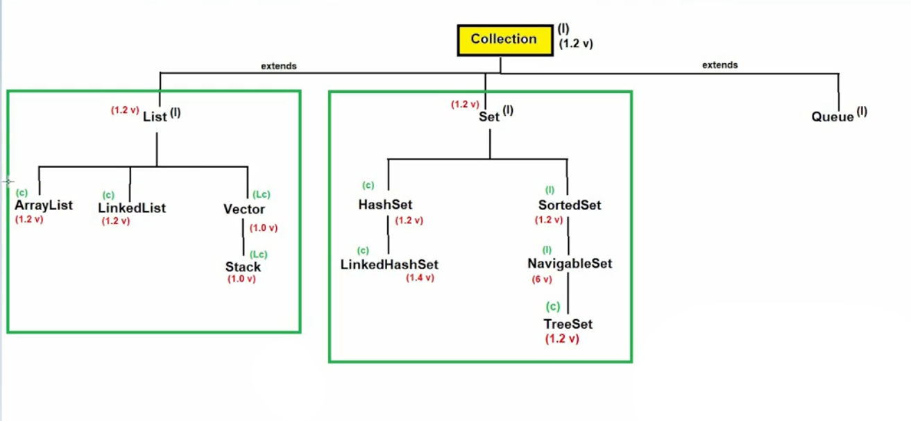
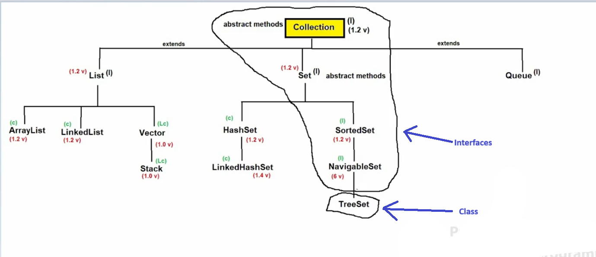
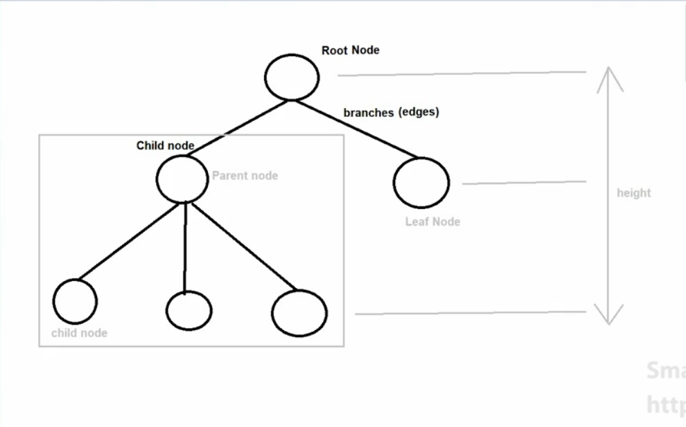
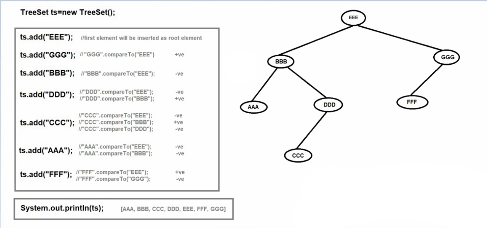

# 🌳 TreeSet in Java

## 📌 What is TreeSet?
- **TreeSet** is a direct implementation of the **NavigableSet** interface.
- It also implements **SortedSet**, **Set**, and **Collection** interfaces.
- **Underlying data structure:** 🌲 *Balanced Tree (Red-Black Tree)*  
- **Introduced in:** ☕ JDK 1.2
- **Syntax:-** 

```java
public class TreeSet<E>
    extends AbstractSet<E>
    implements NavigableSet<E>, Cloneable, Serializable
```







---

## ⚙️✨ Properties of TreeSet


1. 🚫 Not index-based 
2. 🔀 Does **not** follow insertion order 
3. 🔢 Follows **sorting order** (default or customized) 
4. 🧬 Stores **homogeneous** (same type) elements only — throws `ClassCastException` otherwise 
5. ♻️ Does **not** allow duplicate elements 
6. ❌ Can store **only one null** value (up to Java 1.6) 
7. 🔓 **Non-synchronized** collection 
8. 👥 Allows multiple threads simultaneously 
9. ⚡ Allows **parallel execution** 
10. 🚀 Reduces execution time → faster application ⚡ 
11. ❌ **Not thread-safe** 
12. ⚠️ Does **not** guarantee data consistency 

---


## 🔄 How TreeSet Works Internally

1. The **first inserted element** becomes the **root node**.
2. Each new element is compared with existing nodes using `compareTo()`:
   - 🔴 Negative result → goes **LEFT**
   - 🟢 Positive result → goes **RIGHT**
3. This comparison repeats at each level of the tree.
4. **Retrieval order:** `LEFT → ROOT → RIGHT` (In-Order Traversal)



---

## 🏗️ Constructors

| Constructor | Description |
|-------------|-------------|
| `TreeSet()` | Empty TreeSet with **natural/default** sorting order |
| `TreeSet(Comparator comparator)` | Empty TreeSet with **customized** sorting order |
| `TreeSet(Collection c)` | Creates TreeSet from any Collection object |
| `TreeSet(SortedSet s)` | Creates TreeSet from a SortedSet |

---

## 🛠️ Methods

TreeSet contains all methods from:
- `Collection` interface
- `Set` interface
- `SortedSet` interface
- `NavigableSet` interface

---

## ✅ When Should We Use TreeSet?

    1. 📦 When storing a large number of elements.
    2. 📊 When sorted data is required.
    3. ⚡ When fast retrieval is important.

---

## 🚫 Null Value in TreeSet

- Only **one null** value is allowed.
- Null can only be inserted at the **first position**.
- If any other element is added after null → `NullPointerException` 💥
- ⚠️ **After Java 1.6:** Even inserting null at the first position throws `NullPointerException`.

---

## 🔁 HashSet vs LinkedHashSet vs TreeSet

| Feature | HashSet | LinkedHashSet | TreeSet |
|---------|---------|---------------|---------|
| 🏗️ Data Structure | Hashtable | Hashtable + Linked List | Balanced Tree |
| 📋 Insertion Order | ❌ No | ✅ Yes | ❌ No |
| 🔤 Sorting Order | ❌ No | ❌ No | ✅ Yes |
| 🔀 Heterogeneous Objects | ✅ Yes | ✅ Yes | ❌ No |
| 🈳 Null Value | ✅ Allowed | ✅ Allowed | ⚠️ Only up to Java 1.6 |

---

## 📝 Summary

>  TreeSet is best when you need **sorted, unique, and fast-retrievable elements,** and you are okay with no nulls and no thread safety.

🌟 Perfect for ordered data, rankings, and range-based operations!
