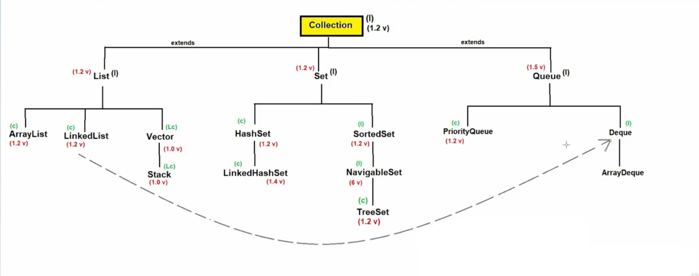
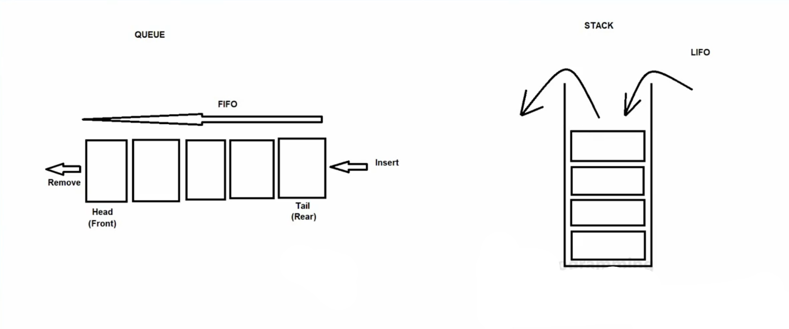
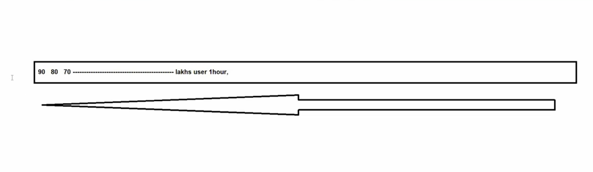

# 🚦 Queue Interface in Java

# 📌 Queue Interface

- Queue is a **child interface of Collection**.
- **Introduced in JDK 1.5**.
- **Syntax:**
  ```java
  public interface Queue<E> extends Collection<E>
  ```
- Queue generally follows **FIFO (First In First Out)** order.
- Ordering behavior **depends on implementation** (e.g., PriorityQueue).

### 🧩 Hierarchy (Simplified)
```
Collection
   ↑
 Queue
   ↑
 Deque
```



### ✅ Properties of Queue

1. ❌ Does **not guarantee insertion order** (depends on implementation)
2. ❌ Does **not guarantee sorting order** (PriorityQueue is priority-based)
3. ✔️ Stores **homogeneous elements** (otherwise `ClassCastException` may occur)
4. ✔️ Allows **duplicate elements**
5. ❌ **Null values not allowed** in most Queue implementations

### 🛠️ Important Queue Methods

| Method | Description |
|------|------------|
| `boolean offer(E e)` | Inserts element, returns `false` if fails |
| `E peek()` | Returns head, or `null` if empty |
| `E element()` | Returns head, throws exception if empty |
| `E poll()` | Removes & returns head, or `null` if empty |
| `E remove()` | Removes & returns head, throws exception if empty |



---

# ⭐ PriorityQueue

- PriorityQueue is an **implementation class of Queue**.
- **Introduced in JDK 1.2**.
- Uses **priority-based ordering** (natural ordering or Comparator).
- **Default initial capacity: 11**.

### 🧠 Key Concept
> Elements are processed based on **priority**, not insertion order 🎯

### 🔍 Properties of PriorityQueue

1. ❌ Does not follow insertion order
2. ❌ Does not strictly follow sorted order when iterating
3. ✔️ Stores homogeneous elements only
4. ✔️ Allows duplicate elements
5. ❌ Null elements **not allowed**
6. ❌ Non-synchronized
7. ❌ Not thread-safe
8. ✔️ Faster performance
9. ❌ No data consistency guarantee in multithreading

### 🏗️ Constructors

```java
PriorityQueue()
PriorityQueue(int capacity)
PriorityQueue(Comparator<? super E> c)
PriorityQueue(int capacity, Comparator<? super E> c)
PriorityQueue(Collection<? extends E> c)
PriorityQueue(PriorityQueue<? extends E> pq)
PriorityQueue(SortedSet<? extends E> ss)
```

### 📦 Methods
- Contains **all Queue + Collection methods**

### 📨 Use Cases

- SMS systems 📩
- Email services 📧
- Offers & notifications 🎁
- Prime / priority users 👑



---

# 🔁 Deque (Double Ended Queue)

- Allows insertion & removal from **both ends**.
- Child interface of Queue.

### 🧾 Syntax
```java
public interface Deque<E> extends Queue<E>
```

### 🔧 Deque Methods

- `addFirst(E e)` / `addLast(E e)`
- `offerFirst(E e)` / `offerLast(E e)`
- `removeFirst()` / `removeLast()`
- `pollFirst()` / `pollLast()`
- `getFirst()` / `getLast()`
- `peekFirst()` / `peekLast()`

---

## ⚡ ArrayDeque

- Implementation class of **Deque**.
- Uses **resizable array** internally.

### 🧾 Syntax
```java
public class ArrayDeque<E>
    extends AbstractCollection<E>
    implements Deque<E>, Cloneable, Serializable
```

### 🔍 Properties of ArrayDeque

1. ✔️ Add/remove from both ends
2. ❌ Null values not allowed
3. ❌ Not synchronized
4. ✔️ No capacity restriction

### 🚀 Advantages

- ⚡ Faster than **LinkedList** and **Stack**
- 🧠 Better memory utilization
- 🔄 Ideal for stack & queue operations

---

✨ **Tip:** Prefer `ArrayDeque` over `Stack` for stack operations in modern Java!

