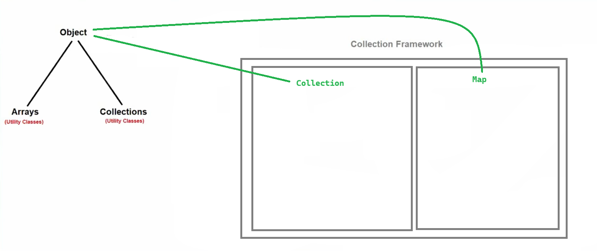
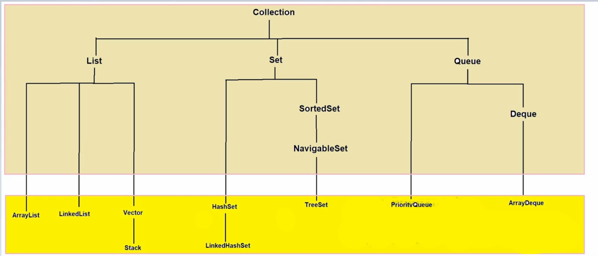
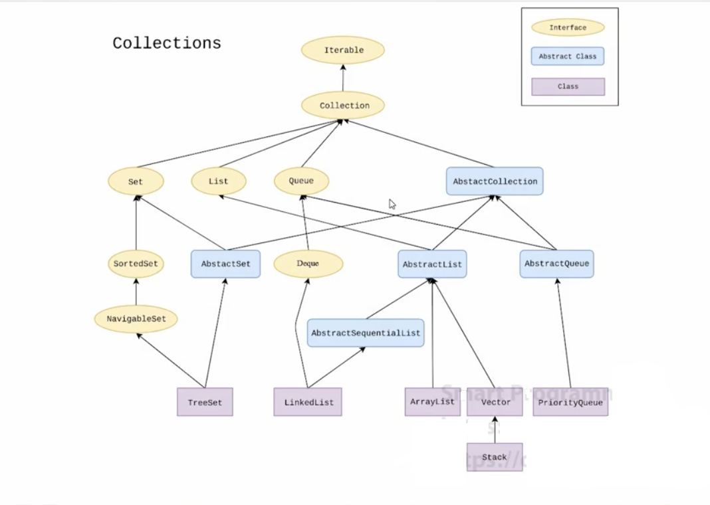
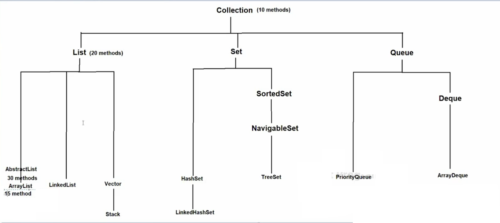
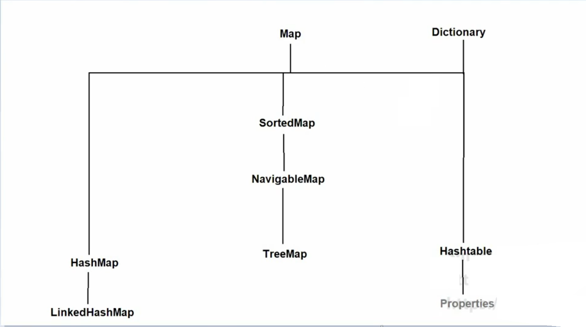
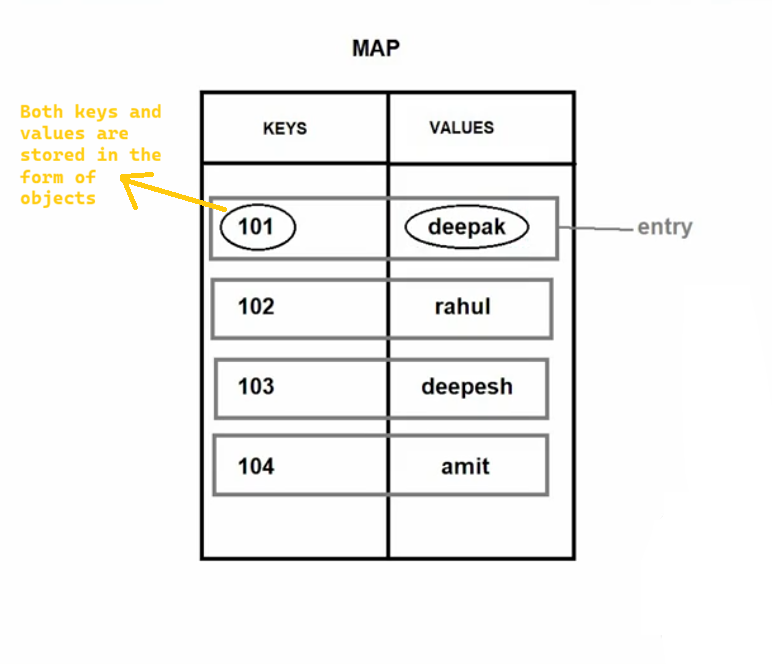

# 📘 Java Map Interface – Notes

---

## 🧩 Map Interface in Java

- `Map` is an **interface** present in the `java.util` package.
- It **does not inherit** the `Collection` interface.
- **Syntax**:
  ```java
  public interface Map { }
  ```
- Introduced in **JDK 1.2** 🚀



---

## 🏗️ Abstract Class Concept (Related to Interfaces)

> Using an abstract class to partially implement an interface.

- We don’t need to implement **all methods** of an interface directly.
- Create an **abstract class** that implements the interface.
- Override required methods inside the abstract class.
- Concrete classes extending the abstract class can skip remaining methods.

✔️ Helps reduce boilerplate code








---

## 🎯 Benefits

1. ✅ Enforces consistency among products
2. 🔁 Makes switching product families easy
3. 🔗 Promotes loose coupling
4. 🧱 Follows Open/Closed Principle

---

## ⚠️ Drawbacks

1. 🧩 More classes → more complexity
2. ❌ Harder to add new product types

---

## 🗂️ Map Interface Overview







### 🔑 Key Features

1. Stores data in **key–value pairs** (called an **Entry**)
2. **Keys must be unique**, values can be duplicate
3. Supports **heterogeneous data**
4. Allows **one null key** and **multiple null values**
5. ❌ Does not follow insertion order (by default)
6. ❌ Does not follow sorting order (by default)

---

## 🧪 Commonly Used Methods of Map

| Method | Description |
|------|------------|
| `put(key, value)` | Inserts a key-value pair |
| `putAll(map)` | Copies all mappings from another map |
| `get(key)` | Returns value for the given key |
| `remove(key)` | Removes entry for the key |
| `clear()` | Removes all entries |
| `isEmpty()` | Checks if map is empty |
| `size()` | Returns number of entries |
| `containsKey(key)` | Checks if key exists |
| `containsValue(value)` | Checks if value exists |
| `keySet()` | Returns set of all keys |
| `values()` | Returns collection of all values |

---

✨ **Tip:** `Map` is heavily used in real-world applications like caching, configuration, and data lookup.

---

🧠 *Happy Learning Java!* ☕🐍

