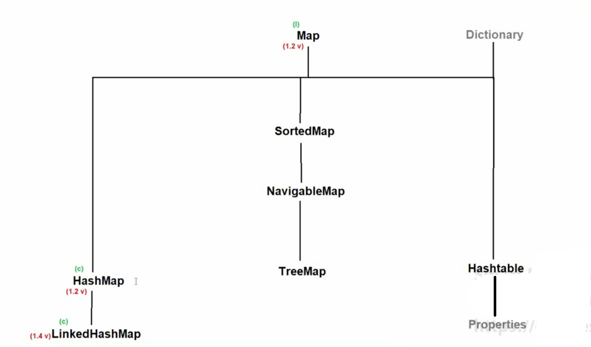
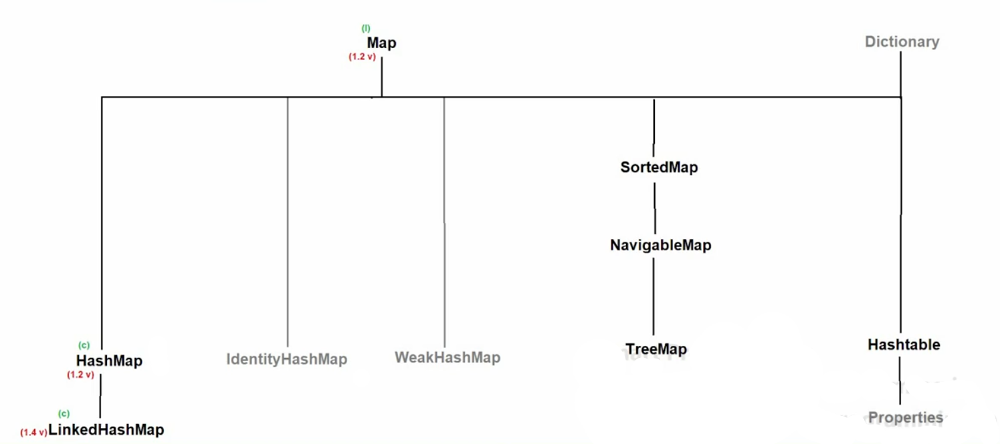
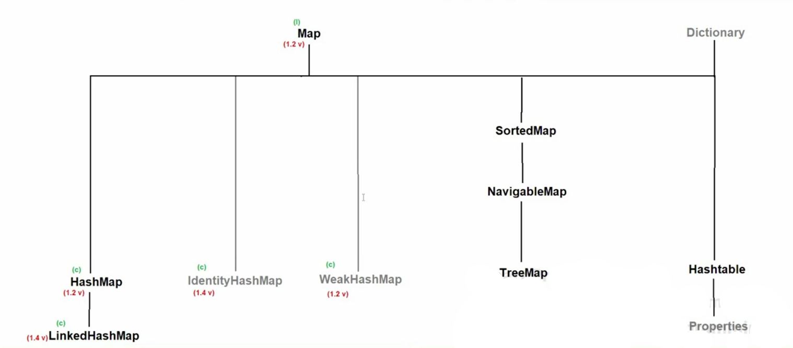
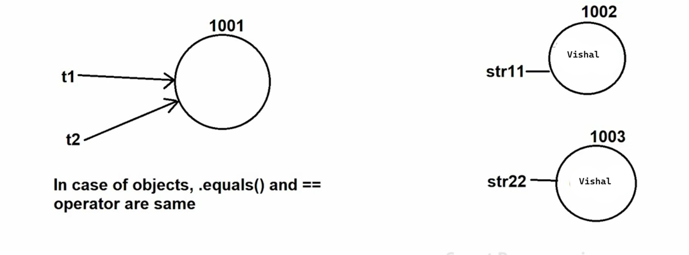
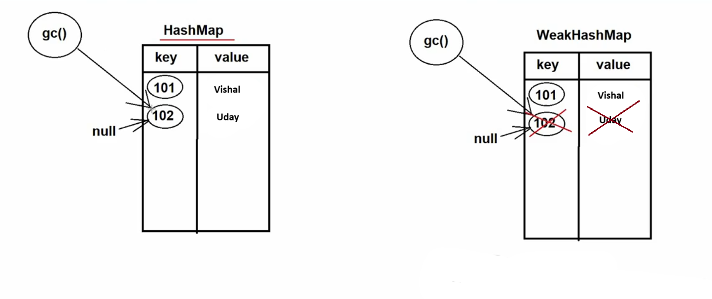

# 📚 Java Collections Notes (Map Variants)

---

## 🔗 LinkedHashMap

### 📌 Definition
- `LinkedHashMap` is a child class of `HashMap` present in the `java.util` package.
- **Syntax:**
  ```java
  public class LinkedHashMap extends HashMap implements Map { }
  ```
- Introduced in **JDK 1.4**.
- Underlying data structure: **Hashtable + LinkedList**.

### ✨ Properties
- Has all properties of `HashMap`.
- ✅ **Maintains insertion order**.

### 🏗 Constructors
- Same constructors as `HashMap`.

### 🛠 Methods
- Same methods as `HashMap`.

### 🧠 When to Use LinkedHashMap?
- Useful for **cache-based applications** 🗂️
- When insertion order matters.



### 🔍 Difference Between HashMap & LinkedHashMap

| HashMap | LinkedHashMap |
|-------|--------------|
| Introduced in JDK 1.2 | Introduced in JDK 1.4 |
| Does not follow insertion order ❌ | Follows insertion order ✅ |
| Underlying DS: Hashtable | Underlying DS: Hashtable + LinkedList |

---

## ⚖️ Difference Between `==` and `.equals()`

- `==` 👉 Used for **reference / address comparison** 🧭
- `.equals()` 👉 Used for **content comparison** 📄

---





## 🆔 IdentityHashMap

### 📌 Definition
- `IdentityHashMap` is an implemented class of the `Map` interface in `java.util`.
- **Syntax:**
  ```java
  public class IdentityHashMap extends AbstractMap
      implements Map, Serializable, Cloneable { }
  ```
- Introduced in **JDK 1.4**.



### ✨ Properties
- Properties, constructors, and methods are same as `HashMap`.

### 🧠 Important Points to Remember
1. A `Map`:
   - ❌ Does not allow duplicate keys
   - ✅ Allows duplicate values
2. In `HashMap`:
   - Keys are compared using `.equals()`
   - If `.equals()` returns `true`, the key is treated as duplicate 🚫
3. In `IdentityHashMap`:
   - Keys are compared using `==`
   - If `==` returns `true`, value is replaced
   - If `==` returns `false`, a new key-value pair is inserted ✅

### 🔍 Difference Between HashMap & IdentityHashMap

| HashMap | IdentityHashMap |
|-------|----------------|
| Introduced in JDK 1.2 | Introduced in JDK 1.4 |
| Uses `.equals()` for key comparison | Uses `==` for key comparison |

---

## 🗑️ How to Delete an Object in Java?

> Objects are deleted by **Garbage Collector (GC)** 🧹

### ✅ Steps:
1. Assign `null` to the object reference
2. Call `gc()` method

⚠️ *Note:* Calling `gc()` does **not guarantee** immediate object deletion.

---

## 🪶 WeakHashMap

### 📌 Definition
- `WeakHashMap` is a class that implements the `Map` interface.
- **Syntax:**
  ```java
  public class WeakHashMap extends AbstractMap implements Map { }
  ```
- Introduced in **JDK 1.2**.



### ✨ Properties
- Properties, constructors, and methods are same as `HashMap`.

### 🔍 Difference Between HashMap & WeakHashMap

| HashMap | WeakHashMap |
|-------|------------|
| Prevents GC from deleting entries ❌ | Allows GC to delete entries 🧹 |
| Strong reference to keys | Weak reference to keys |

---

✨ **Tip:** `WeakHashMap` is useful when you want automatic memory cleanup, such as in caching scenarios.

---

📌 *Happy Learning Java!* ☕🚀

