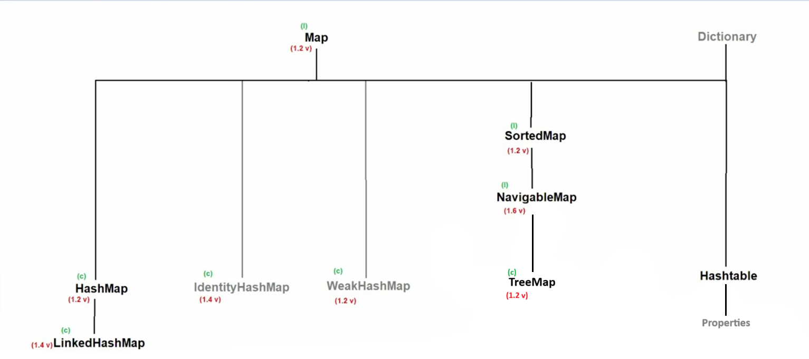
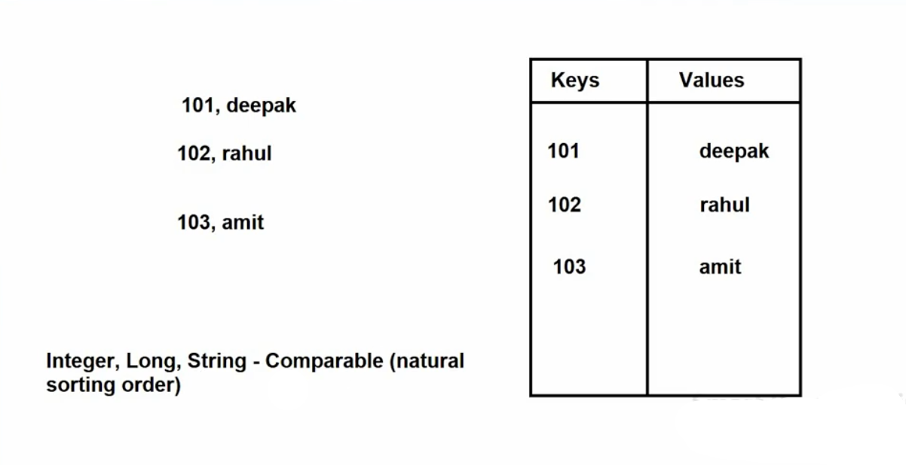
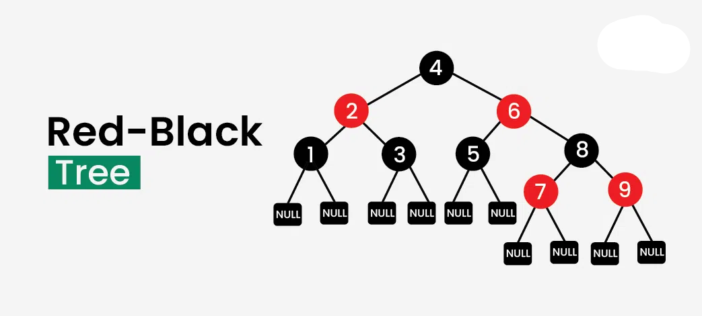

# 📚 SortedMap, NavigableMap & TreeMap in Java

---

# 🔹 SortedMap

➡️ **SortedMap** is a child interface of the **Map** interface present in the `java.util` package.

**Syntax**
```java
public interface SortedMap<K,V> extends Map<K,V>
```

🗓 **Introduced in:** JDK 1.2

---



## ✨ Properties of SortedMap

1️⃣ Stores data in **key-value pairs**.  
   - Key must be **unique**  
   - Values can be **duplicate**

2️⃣ Does **not follow insertion order** with respect to keys.

3️⃣ Follows **sorted order of keys**.

4️⃣ Keys can be **homogeneous or heterogeneous** depending on sorting:

- **Natural Sorting (Comparable)**
  - Keys must be **homogeneous and Comparable**
  - Otherwise → `ClassCastException`

- **Custom Sorting (Comparator)**
  - Keys can be **heterogeneous**



5️⃣ **Null key is not allowed** (in implementations like TreeMap).  
   Values **can be null**.

6️⃣ SortedMap is **non-synchronized**.

---

## 🛠 Methods of SortedMap

| Method | Description |
|------|-------------|
| `K firstKey()` | Returns first (smallest) key |
| `K lastKey()` | Returns last (largest) key |
| `SortedMap<K,V> headMap(K toKey)` | Returns keys **less than toKey** |
| `SortedMap<K,V> tailMap(K fromKey)` | Returns keys **greater than or equal to fromKey** |
| `SortedMap<K,V> subMap(K fromKey, K toKey)` | Returns keys between given range |
| `Comparator comparator()` | Returns comparator used for sorting |

---

# 🔹 NavigableMap

➡️ **NavigableMap** is a child interface of **SortedMap** present in `java.util`.

**Syntax**
```java
public interface NavigableMap<K,V> extends SortedMap<K,V>
```

🗓 **Introduced in:** Java SE 6

---

## ✨ Properties of NavigableMap

✅ Same as **SortedMap**  
➕ Provides **extra navigation methods** to move through the map.

These methods help to find **closest matches of keys**.

---

## 🛠 Methods of NavigableMap

| Method | Description |
|------|-------------|
| `NavigableMap descendingMap()` | Returns map in reverse order |
| `K ceilingKey(K key)` | Returns smallest key ≥ given key |
| `K higherKey(K key)` | Returns smallest key > given key |
| `K floorKey(K key)` | Returns largest key ≤ given key |
| `K lowerKey(K key)` | Returns largest key < given key |
| `Map.Entry pollFirstEntry()` | Removes and returns first entry |
| `Map.Entry pollLastEntry()` | Removes and returns last entry |

---

# 🔹 TreeMap

➡️ **TreeMap** is a class that implements **NavigableMap, SortedMap, and Map**.

**Syntax**
```java
public class TreeMap<K,V> 
extends AbstractMap<K,V> 
implements NavigableMap<K,V>, Cloneable, Serializable
```

🗓 **Introduced in:** JDK 1.2

⚙ **Underlying Data Structure:**  
➡️ **Red-Black Tree**



---

## ✨ Properties of TreeMap

1️⃣ Stores **key-value pairs**.  
   - Keys must be **unique**  
   - Values can be **duplicate**

2️⃣ Does **not follow insertion order**.

3️⃣ Follows **sorted order of keys**.

4️⃣ Supports **natural sorting** or **custom sorting using Comparator**.

5️⃣ **Null keys are not allowed**.  
   **Null values are allowed**.

6️⃣ **Non-synchronized**.

7️⃣ **Not thread-safe**.

8️⃣ Allows **multiple threads**, but synchronization must be handled manually.

9️⃣ Provides **log(n) time complexity** for most operations.

---

## 🏗 Constructors of TreeMap

| Constructor | Description |
|------|-------------|
| `TreeMap()` | Creates TreeMap with natural sorting |
| `TreeMap(Comparator comparator)` | Creates TreeMap with custom sorting |
| `TreeMap(Map m)` | Creates TreeMap from another Map |
| `TreeMap(SortedMap m)` | Creates TreeMap from SortedMap |

---

## 🛠 Methods

TreeMap implements all methods of:

- Map
- SortedMap
- NavigableMap

---

# ⚠ Null Key Insertion in TreeMap

### Java 1.6
- One **null key allowed** if inserted first
- Further insertions may cause **NullPointerException**

### Java 1.7 and later
❌ **Null keys are completely not allowed**

---

# 🔍 Difference Between HashMap, LinkedHashMap & TreeMap

| Feature | HashMap | LinkedHashMap | TreeMap |
|------|------|------|------|
| Introduced | JDK 1.2 | JDK 1.4 | JDK 1.2 |
| Data Structure | Hashtable | Hashtable + LinkedList | Red-Black Tree |
| Insertion Order | ❌ No | ✅ Yes | ❌ No |
| Sorting Order | ❌ No | ❌ No | ✅ Yes |
| Heterogeneous Keys | ✅ Allowed | ✅ Allowed | ❌ Only homogeneous (natural sorting) |
| Null Key | ✅ Allowed | ✅ Allowed | ❌ Not Allowed |
| Null Values | ✅ Allowed | ✅ Allowed | ✅ Allowed |

---

# 🧠 When Should We Use TreeMap?

Use **TreeMap** when:

✔ You need **sorted data**  
✔ You need **fast searching & retrieval**  
✔ You want **navigation methods (ceiling, floor, higher, lower)**

Example Use Cases:

- Ranking systems 🏆
- Leaderboards 📊
- Sorted dictionaries 📖
- Range queries 🔎

---

# 📌 Quick Summary

| Interface/Class | Purpose |
|------|------|
| **SortedMap** | Map with sorted keys |
| **NavigableMap** | SortedMap with navigation methods |
| **TreeMap** | Implementation using Red-Black Tree |

---

✅ **Tip for Interviews:**  
If interviewer asks **"Which Map maintains sorted order?"**

👉 Answer: **TreeMap**
