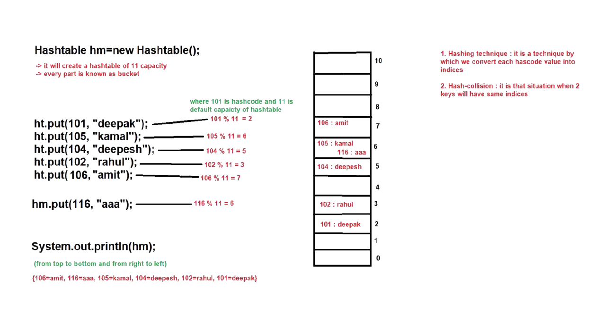
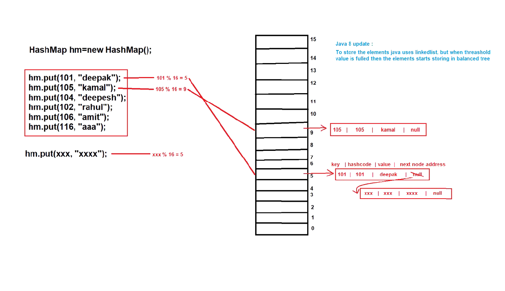

# 📚 Hashtable & HashMap in Java

---

# 🔹 Hashtable in Java

👉 **Hashtable** is a direct implemented class of the `Map` interface which is present in the **java.util** package.

```java
public class Hashtable extends Dictionary implements Map, Cloneable, Serializable 
{
    
}
```

🗓️ **Introduced in:** JDK 1.0  
📌 **Type:** Legacy Class  
🧠 **Underlying Data Structure:** Hashtable

---

## ⚡ Properties of Hashtable

1️⃣ Hashtable stores data in **key-value pairs**.  
2️⃣ Each key-value pair is known as an **Entry**.  
3️⃣ **Keys must be unique**, but **values can be duplicate**.  
4️⃣ Hashtable can store **heterogeneous elements** at key position.  
5️⃣ ❌ **Null key and null value are not allowed**.  
6️⃣ Does **not follow insertion order**.  
7️⃣ Does **not follow sorting order**.  
8️⃣ Hashtable is a **synchronized Map**.  
9️⃣ Only **one thread can access at a time**.  
🔟 Allows **sequential execution**.  
1️⃣1️⃣ Synchronization **increases execution time**.  
1️⃣2️⃣ Hashtable is **thread-safe** and provides **data consistency**.

---

# 🏗️ Constructors of Hashtable

```java
// Default constructor
public Hashtable()
```
📌 Creates a Hashtable with **initial capacity = 11**  
📌 Default **load factor = 0.75**

```java
public Hashtable(Map t)
```

```java
public Hashtable(int initialCapacity)
```

```java
public Hashtable(int initialCapacity, float loadFactor)
```

---

# ⚙️ Methods

📌 Hashtable supports **all methods of Map interface**.

Example methods:

```java
put()
get()
remove()
containsKey()
containsValue()
size()
isEmpty()
```

---

# 🧑‍💻 Example Program

```java
import java.util.Hashtable;

public class HashtableExample {
    public static void main(String[] args) {

        Hashtable<Integer, String> ht = new Hashtable<>();

        ht.put(1, "Java");
        ht.put(2, "Python");
        ht.put(3, "C++");

        System.out.println(ht);
        System.out.println(ht.get(2));
    }
}
```

---

# 🎯 When Should We Use Hashtable?

✅ Best for **searching and retrieval operations**.  
✅ Useful when **thread safety is required**.

---

# ⚙️ Working of Hashtable

🧠 **hashCode()**

- Every object has a **unique integer value called hashcode** generated by JVM.



### Steps of Working

1️⃣ Initial Capacity of Hashtable = **11**

2️⃣ For every key, JVM generates a **hashcode value**.

3️⃣ Using **hashing technique**, an **index position** is calculated.

4️⃣ The **key-value pair (entry)** is stored at that index.

5️⃣ If two elements have the **same index**, then:

➡️ New entry is inserted to the **right side of previous entry**.

6️⃣ Traversal happens:

⬇️ **Top → Bottom**  
⬅️ **Right → Left**

---

# ⚙️ Working of HashMap

📌 Initial Capacity of HashMap = **16**



### Steps

1️⃣ For every key-value pair, **hashcode is generated**.

2️⃣ Index position is calculated.

3️⃣ Element is stored in that **index bucket**.

4️⃣ If multiple elements have the **same index**:

➡️ A **LinkedList is created**.

5️⃣ In **Java 8 Update**

If the **threshold is exceeded**, LinkedList converts into:

🌳 **Balanced Tree (Red-Black Tree)**

This improves performance.

---

# ⚔️ Difference Between HashMap & Hashtable

| Feature | HashMap 🗺️ | Hashtable 🧾 |
|------|------|------|
| Introduced | JDK **1.2** | JDK **1.0** |
| Type | Non-Legacy Class | Legacy Class |
| Null Key | ✅ Allowed | ❌ Not Allowed |
| Null Value | ✅ Allowed | ❌ Not Allowed |
| Synchronization | ❌ Non-Synchronized | ✅ Synchronized |
| Performance | ⚡ Faster | 🐢 Slower |
| Thread Safety | ❌ Not Thread Safe | ✅ Thread Safe |

---

# 🧠 Summary

✔️ **HashMap**
- Faster
- Allows null values
- Not synchronized

✔️ **Hashtable**
- Thread-safe
- Synchronized
- No null values
- Slower performance

---

✨ **Tip:**  
In modern Java development, **HashMap is preferred** over Hashtable.  
If thread safety is needed, use:

```java
Collections.synchronizedMap(new HashMap<>());
```

or

```java
ConcurrentHashMap
```

---