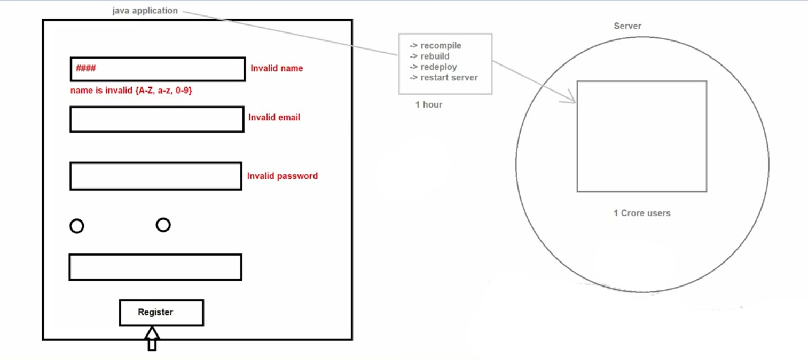
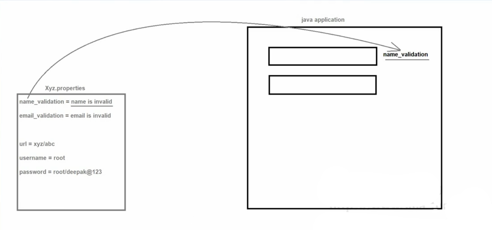
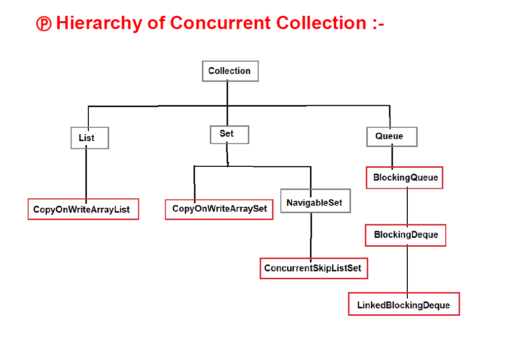
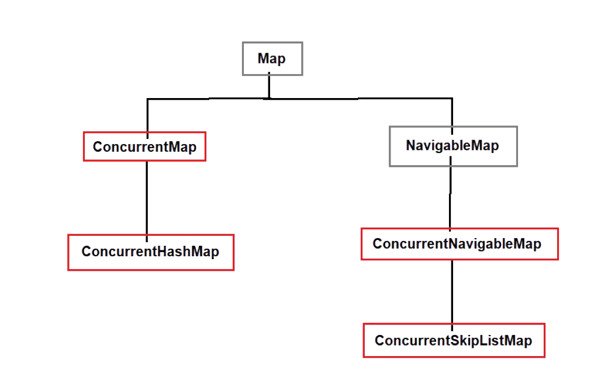

# 📚 Dictionary, Properties & Concurrent Classes in Java

---

# 📘 Dictionary Class

## 🔹 Introduction

* **Dictionary** is an **abstract class** present in the **`java.util` package**.
* It represents **key-value pairs** similar to the **Map interface**.

### 🧾 Syntax

```
public abstract class Dictionary { }
```

* Since **Dictionary is abstract**, we **cannot create its object directly**.
* It was introduced in **JDK 1.0**.
* Java **does not support multiple inheritance**, so if a class extends `Dictionary`, it **cannot extend another class**.
* Because of this limitation, the **Map interface was introduced**.
* Today, **Dictionary is rarely used** and **Map interface is preferred**.

---

## ⚙️ Methods of Dictionary

| Method                                 | Description                           |
| -------------------------------------- | ------------------------------------- |
| `int size()`                           | Returns the number of key-value pairs |
| `boolean isEmpty()`                    | Checks whether dictionary is empty    |
| `Enumeration keys()`                   | Returns enumeration of keys           |
| `Enumeration elements()`               | Returns enumeration of values         |
| `Object get(Object key)`               | Returns value associated with the key |
| `Object put(Object key, Object value)` | Inserts key-value pair                |
| `Object remove(Object key)`            | Removes the key-value pair            |

---

# 📘 Properties Class

## 🔹 Introduction

* **Properties** is a **child class of `Hashtable`**.
* It is present in the **`java.util` package**.

### 🧾 Syntax

```
public class Properties extends Hashtable { }
```

* A **Properties file stores data in key-value pairs**.
* It **only supports String type keys and values**.

---

## 📌 When to Use Properties

Use **Properties files** when data may **change frequently in the future**.

Instead of **hardcoding values in Java programs**, we store them in a **properties file**.






### 🚀 Advantages

* No need to **recompile the application**
* No need to **rebuild**
* No need to **redeploy**
* Sometimes **no need to restart the server**

### 📍 Example Use Cases

* Database configuration
* Application validations
* Exception messages
* Environment configurations

---

## 🏗️ Constructors

| Constructor                       | Description                            |
| --------------------------------- | -------------------------------------- |
| `Properties()`                    | Creates an empty properties object     |
| `Properties(Properties defaults)` | Creates properties with default values |

---

## ⚙️ Important Methods

| Method                                     | Description                        |
| ------------------------------------------ | ---------------------------------- |
| `load(InputStream is)`                     | Loads properties from input stream |
| `getProperty(String pname)`                | Returns property value             |
| `setProperty(String pname, String pvalue)` | Sets property value                |
| `store(OutputStream os, String comments)`  | Saves properties to output stream  |

---

# 📘 Concurrent Collections

## 📅 Introduced In

* **JDK 1.5**

## 🔹 Why Concurrent Collections Were Introduced

Most **traditional collections** are **non-synchronized**, such as:

* `ArrayList`
* `LinkedList`
* `HashSet`
* `HashMap`

### ⚠️ Problems with Traditional Collections

1️⃣ **No data consistency**

* Non-synchronized collections **do not guarantee thread safety**.

2️⃣ **Low performance of synchronized classes**

* Classes like **Vector** and **Stack** are synchronized but **slow**.

3️⃣ **ConcurrentModificationException**

If one thread **iterates** a collection and another thread **modifies it**, Java throws:

```
ConcurrentModificationException
```

---

## 💡 Solution: Concurrent Collections

To solve these issues, **Concurrent Collections** were introduced.

### 📌 Features

* Designed for **multithreaded environments**
* Provide **better performance**
* Ensure **thread safety**


### 📦 Package

```
java.util.concurrent
```

---

## 🧩 Examples of Concurrent Collection Classes

* `ConcurrentHashMap`
* `CopyOnWriteArrayList`
* `CopyOnWriteArraySet`
* `BlockingQueue`
* `ConcurrentLinkedQueue`

These classes provide **safe and efficient data access in multithreaded applications**.






---

# 🧠 Summary

| Topic                  | Key Idea                                               |
| ---------------------- | ------------------------------------------------------ |
| Dictionary             | Legacy abstract class for key-value pairs              |
| Properties             | Used to store configurable key-value data              |
| Concurrent Collections | Thread-safe collections for multithreaded applications |

---

✨ **Tip:** In modern Java development, developers usually use **Map and Concurrent Collections instead of Dictionary.**

---
