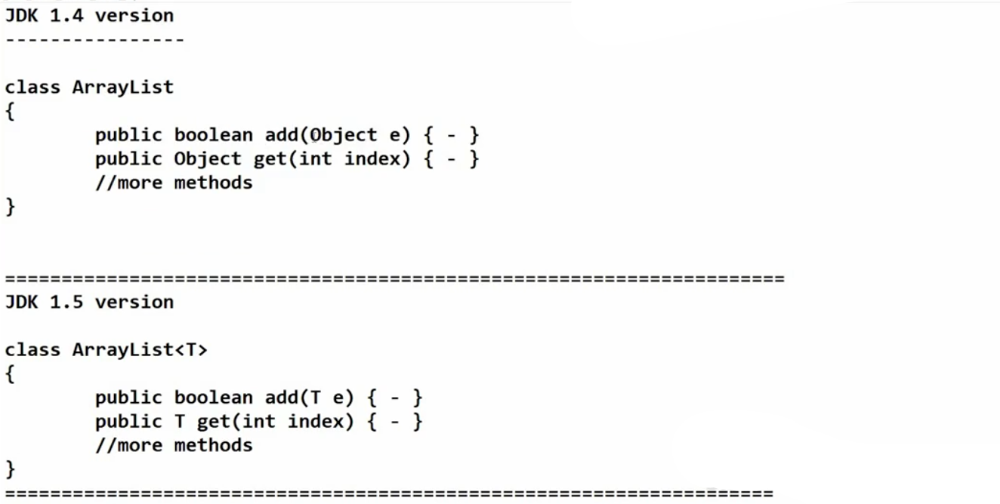
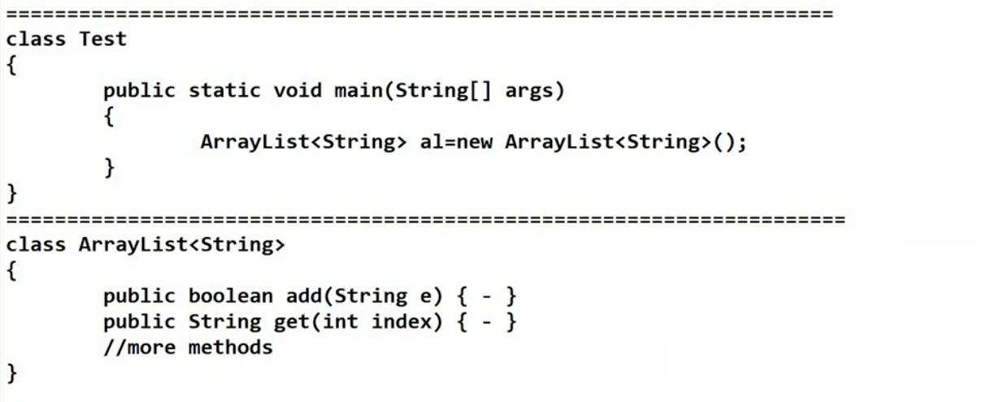
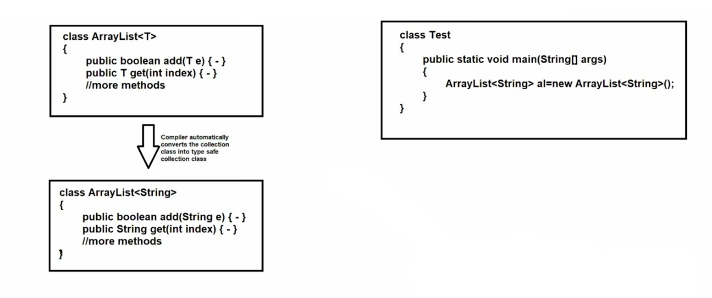

# 📘 Generics in Java

---

## 🔹 Generics

* **Generics** means **parameterized types**, which means we can provide any type of parameter to **classes, interfaces, or methods**.
* Generics were introduced in **JDK 1.5**.
* Generics are represented by **angular brackets `< >`**.

### 🎯 Main Objectives of Generics

1. ✅ **To provide type safety**
2. 🔄 **To resolve type casting problems**





---

### 📌 Additional Points

* By default **arrays are type-safe**.
  👉 *Type Safety:* We cannot store different types of data in an array.

* For **Collections**, until **JDK 1.4**, collections were **not generic types**.

* In **JDK 1.5**, **Generic Collections** were introduced.

⚠️ **Note:**
Generics only work with **Non-Primitive data types**.
Examples: `Integer`, `Double`, `String`
(Not allowed: `int`, `double`, `char`)

---

# 📦 Generic Classes

* If any class is declared with **type parameters**, it is known as a **Generic Class**.

* Generic classes can be:

  * 👨‍💻 **User-defined classes**
  * 📚 **Predefined classes (Collection classes)**

* Generic type names can be **any valid identifier**.

* We can provide **multiple parameters** in Generics.

### Example Type Parameters

Common naming conventions:

* `T` → Type
* `E` → Element
* `K` → Key
* `V` → Value
* `N` → Number




---

# 🔒 Generic Bounded Types

* Sometimes we want to **restrict the type parameter to a specific range**.

* This is done using the **`extends` keyword**.

👉 This concept is called **Generic Bounded Types**.

### Syntax

```
class A<T extends X>
```

`X` can be a **class or interface**.

---

### 📌 Important Rules

1️⃣ Only **`extends` keyword** is used (not `implements`).

2️⃣ Only **Non-Primitive data types** are allowed.

3️⃣ Multiple bounds are possible.

Example syntax:

```
class A<T extends X & Y>
```

Here:

* `X` = Class
* `Y` = Interface

---

# 🧩 Generic Methods & Wildcards ( ? )

* **Wildcard (`?`)** represents an **unknown type**.

* It is used to **increase flexibility** when working with **generic collections or methods**.

---

# 🔍 Types of Wildcards

---

## 1️⃣ Upper Bounded Wildcards (`? extends T`)

* Restricts the unknown type to **a specific type or its subclasses**.

### Example

```
List<? extends Number>
```

This can accept:

* `List<Integer>`
* `List<Double>`
* `List<Number>`

### 📌 Use Case

* Best for **reading data** from a structure.

💡 Think of it as **Producer → Read Only**

---

## 2️⃣ Lower Bounded Wildcards (`? super T`)

* Restricts the unknown type to **a specific type or its superclasses**.

### Example

```
List<? super Integer>
```

This can accept:

* `List<Integer>`
* `List<Number>`
* `List<Object>`

### 📌 Use Case

* Best when **adding data** into a structure.

💡 Think of it as **Consumer → Write Data**

---

## 3️⃣ Unbounded Wildcards (`?`)

* Represents a **completely unknown type**.

### Example

```
List<?>
```

This can accept:

* `List<String>`
* `List<Integer>`
* `List<Double>`
* `List<Object>`

### 📌 Use Case

Useful when:

* Only **Object class methods** are required (`equals()`, `toString()`, etc.)
* The **exact type is not important**
* We only need operations like:

  * `size()`
  * `isEmpty()`

---

# ⭐ Summary

| Concept         | Purpose                                     |
| --------------- | ------------------------------------------- |
| Generics        | Provide type safety and remove type casting |
| Generic Classes | Classes with type parameters                |
| Bounded Types   | Restrict type parameters                    |
| Wildcards       | Provide flexibility with unknown types      |
| `? extends T`   | Read data                                   |
| `? super T`     | Write data                                  |
| `?`             | Unknown type                                |

---

✅ **Key Idea:**
Generics make Java code **safer, reusable, and easier to maintain**.
