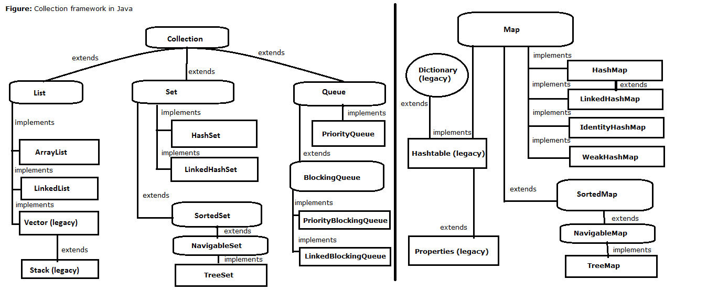

# 📚 Collection Framework in Java

---

## 🔹 Collection Framework in Java
👉 The **Collection Framework** is a powerful API provided by Java to **store, manipulate, and retrieve groups of objects efficiently** 🚀

---

## 🧱 Types of Data Structures

### 1️⃣ Primitive Data Structure
- Stores **single values**
- Faster & memory efficient ⚡

🔹 **Examples:**
- `boolean`
- `char`
- `byte`
- `short`
- `int`
- `long`
- `float`
- `double`

---

### 2️⃣ Non-Primitive Data Structure
- Stores **multiple values or complex data**
- Built using classes & objects 🧩

🔹 **Examples:**
- `String`
- `Files`
- `Arrays`
- **Collection Framework** (`Collection`, `Map`)

---

## 🧮 Applications of Arrays

Arrays are widely used in programming 👇

1️⃣ Store **multiple values** using a single variable name ➝ reduces code complexity

2️⃣ Used in **sorting algorithms** 🧠
   - Bubble Sort
   - Insertion Sort
   - Selection Sort

3️⃣ Perform **matrix operations** ➕➖✖️

4️⃣ Used in **CPU Scheduling algorithms** 🖥️

5️⃣ Used to implement **data structures**:
   - Stack
   - ArrayList
   - Queue

---

## ⚖️ Array vs Collection Framework (Important Points)

### 1️⃣ Nature
- 🟦 **Array:** Java language feature (inbuilt support by Sun Microsystems)
- 🟩 **Collection:** API feature (predefined classes & interfaces)

---

### 2️⃣ Data Types
- 🟦 **Array:** Can store **primitive + non-primitive** data types
- 🟩 **Collection:** Can store **only non-primitive (objects)**

---

### 3️⃣ Type of Data
- 🟦 **Array:** Stores **homogeneous data** (same type)
- 🟩 **Collection:** Stores **heterogeneous data** (different types)

---

### 4️⃣ Size
- 🟦 **Array:** Fixed size ❌ (cannot grow or shrink at runtime)
- 🟩 **Collection:** Dynamic size ✅ (can grow or shrink)

---

### 5️⃣ Memory Management
- 🟦 **Array:** Not efficient in terms of memory ❌
- 🟩 **Collection:** Better memory utilization ✅

---

### 6️⃣ Performance
- 🟦 **Array:** Better performance ⚡
- 🟩 **Collection:** Slightly slower due to overhead 🐢

---

## ❓ What is Collection Framework?

📌 The term **Collection Framework** consists of two words:

### 🔹 Collection
- A **single object** that holds **multiple data elements** 📦

### 🔹 Framework
- Represents a **library** of predefined code 🏛️

👉 **Collection Framework** is a set of **classes and interfaces** used to implement **commonly reusable data structures**.

---

## 🧩 Main Parts of Collection Framework

1️⃣ `java.util.Collection`
2️⃣ `java.util.Map`

---

## 🗂️ Collection vs Map

- 🟢 **Collection:** Stores data **directly**
- 🔵 **Map:** Stores data in **key–value pairs** 🔑➡️📄

---

## 🔑 9 Key Interfaces of Collection Framework

1️⃣ `Collection`
2️⃣ `List`
3️⃣ `Set`
4️⃣ `SortedSet`
5️⃣ `NavigableSet`
6️⃣ `Queue`
7️⃣ `Map`
8️⃣ `SortedMap`
9️⃣ `NavigableMap`

---

## 🌳 Hierarchy of Collection Framework

📌 The Collection Framework follows a **well-defined hierarchy** where:
- `Collection` is the **root interface** for List, Set, and Queue
- `Map` is **separate** and does **not extend Collection**

---

✨ **Tip:** Use **Arrays** when performance is critical and size is fixed. Use **Collections** when flexibility, easy operations, and scalability are required.

Happy Learning & Coding! 💻☕🚀

