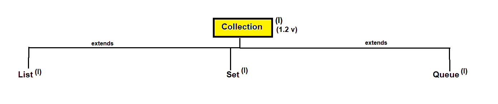

# 📚 Collection Interface in Java

## 👉 Collection

- 📦 **Collection** is an interface present in the `java.util` package.
- ✍️ **Syntax**:
  ```java
  public interface Collection<E> extends Iterable<E> { }
  ```
- 🕰️ Introduced in **JDK 1.2**.
- 🧩 A collection is an object used to represent a **group of individual objects as a single unit**.
- 🌳 The **Collection interface is the root interface** of the Collection Framework.
- ❌ There is **no concrete class** that directly implements the `Collection` interface.
- ✅ It is inherited by other interfaces such as **List**, **Set**, and **Queue**.

---

## 🧱 Hierarchy of Collection Interface

```
Iterable
   ↑
Collection
   ↑
---------------------------------
|               |               |
List            Set            Queue
```


---

## 🛠️ Methods of Collection Interface

### ➕ Insertion Methods
1. `boolean add(Object obj);`
2. `boolean addAll(Collection c);`

### ➖ Removal Methods
3. `boolean remove(Object obj);`
4. `boolean removeAll(Collection c);`
5. `default boolean removeIf(Predicate<? super E> filter);`
6. `boolean retainAll(Collection c);`
7. `void clear();`

### 🔍 Search Methods
8. `boolean contains(Object obj);`
9. `boolean containsAll(Collection c);`

### 📊 Utility Methods
10. `boolean isEmpty();`
11. `int size();`
12. `Iterator iterator();`
13. `Object[] toArray();`

### ⚖️ Object Class Methods
14. `boolean equals(Object obj);`
15. `int hashCode();`

---

## 🔄 Difference Between Collection and Collections

| Collection 🧩 | Collections 🧰 |
|-------------|----------------|
| Collection is an **interface** | Collections is a **utility class** |
| Represents a group of objects | Provides utility methods like sorting, searching |
| Contains abstract, default, and static methods | Contains **only static methods** |

---

## 🧪 What is a Utility Class in Java?

- 🧠 Also known as a **helper class**.
- 🚫 Cannot be instantiated.
- ⚡ Contains **only static methods**.
- 📌 Examples: `Arrays`, `Collections`.

---

## 🏗️ How to Create a Utility Class

1. 🔒 Declare the class as `public final`.
2. 🚪 Provide a `private` constructor to prevent object creation.
3. ⚙️ Class should contain **only static methods**.
4. 📝 Every method should have **proper documentation**.

### ✅ Example
```java
public final class UtilityExample {
    private UtilityExample() {
        // Prevent instantiation
    }

    public static void sayHello() {
        System.out.println("Hello from Utility Class!");
    }
}
```

---

## 🧩 What are Utility Methods?

- 🔁 Perform **common and reusable operations**.
- ⚡ Always **static** in nature.
- 🧰 Used across applications for convenience.

### 📌 Examples
- 🔢 Sorting methods
- 🔍 Searching methods
- ✂️ String manipulation methods
- 🗄️ Database connection helper methods

---

✨ *Happy Learning Java Collections!* ☕🚀
