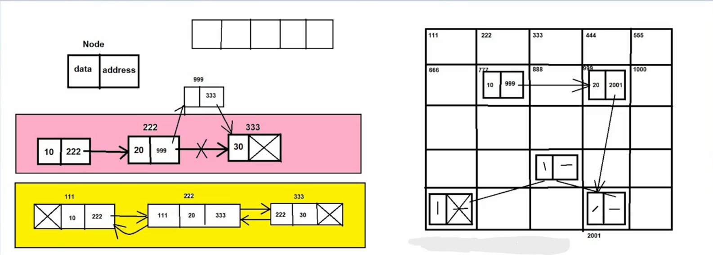

# 🔗 => LinkedList in Java

## 📘 => LinkedList :-

-> LinkedList is an implementation class of List interface which is present in java.util package.
-> Syntax : public class LinkedList extends AbstractSequentialList implements List, Deque, Cloneable, Serializable { - }
-> The underline data structure of LinkedList is Double Linked List or Circular Linked List.
-> LinkedList was introduced in JDK 1.2 version.

## 🧩 -> Properties of LinkedList :-
    1. LinkedList is an index based Data Structure which means that first element will be inserted at 0 
        index position.
    2. LinkedList can store different data types or hetrogeneous elements,
    3. We can store duplicate elements in the LinkedList.
    4. We can store any number of null values in the LinkedList.
    5. LinkedList follows the insertion order which means the sequence in which we are inserting the elements,
         in the same sequence we can retrieve the elements.
    6. LinkedList does not follow the sorting order
    (above properties are same as List interface)
    7. LinkedList is non-synchronized collection because LinkedList does not contain any synchronized method.
    8. LinkedList allows more than one thread at one time.
    9. LinkedList allows parallel execution.
    10. LinkedList reduces the execution time which in turn makes the application fast.
    11. LinkedList is not threadsafe.
    12. LinkedList does not gurantee for data consistency.

## ⚙️ -> Working of LinkedList :-
1. Types of LinkedList (all programming languages) :-
    a. Single Linked List
    b. Double Linked List
    c. Circular Linked List
2. Linked List are linear data structure in which elements are not stored in contigeous memory locations.
3. There is no capacity concept in LinkedList like ArrayList

## 🏗️ -> Constructors :-
    1. public LinkedList()
    2. public LinkedList(Collection c)

## 🛠️ -> Methods of LinkedList :-
1. Methods of Collection Interface
2. Methods of List Interface
3. public void addFirst(Object obj)
4. public void addLast(Object obj)
5. public Object getFirst()
6. public Object getLast()
7. public Object removeFirst()
8. public Object removeLast()

## ✅ -> When we should use LinkedList ?
+> LinkedList is best when we have to use insertion or deletion operations

## ❌ -> When we should not use LinkedList ?
+> LinkedList is worst in case of retrieval or searching operations (as LinkedList does not inherit RandomAccess interface)

## 🔍 -> What is difference between ArrayList & LinkedList ?

1.  ArrayList underline data structure is dynamic array or resizable array.
    LinkedList underline data structure is double linked list or circular linked list.

2.  ArrayList stores the elements in contigeous memory locations.
    LinkedList does not store the elements in contigeous memory locations.

3.  ArrayList acts as List.
    LinkedList can acts as List or Deque.

4.  ArrayList is good in case of retrieval operations.
    LinkedList is good in case of insertion and deletion operations.

5.  ArrayList is worst in case of insertion or deletion operations.
    LinkedList is worst in case of retrieval operations.