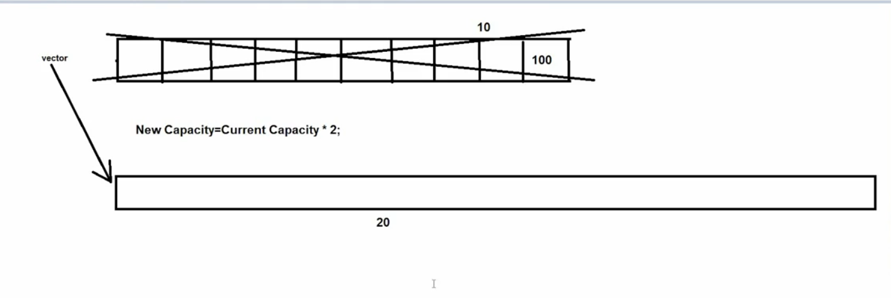

## 🧭 => Vector in Java

## 📘 => Vector :-

-> Vector is an implementation class of List interface which is present in **java.util package**.

-> Syntax : public class Vector extends AbstractList implements List, RandomAccess, Cloneable, Serializable { - }.

-> The underline data structure of Vector is **resizable array or growable array**.

-> Vector was introduced in *JDK 1.0 version*.

-> Vector class is also known as legacy class.
(Legacy class is the class which was formed in previous version and was restructured or re-engineered in new version).

## 🧩 -> Properties of Vector :-

1. 📍 Vector is an index-based data structure (starts from index 0).

2. 🧩 It can store heterogeneous elements.

3. 🔁 Duplicate elements are allowed.

4. 🚫 Multiple null values are allowed.

5. 🔄 Follows insertion order.

6. 📉 Does not follow sorting order.

(Properties 1–6 are same as List interface)

7. 🔒 Vector is a synchronized collection.

8. 🧵 Allows only one thread at a time.

9. ⛔ Does not allow parallel execution.

10. 🐢 Slower performance due to synchronization.

11. ✅ Vector is thread-safe.

12. 🛡️ Guarantees data consistency

## ⚙️ -> Working of Vector :-

1. 📦 When a Vector is created, it has an **initial capacity of 10**.

2. 📈 When the Vector becomes full, a new Vector is created with:

            New Capacity = Current Capacity × 2

3. 🔁 All elements from the *old Vector are copied into the new Vector*. 🗑️ Then the old Vector is removed from memory by the Garbage Collector.

## 📝 Note :-
In Vector, we can explicitly find the capacity.

## 🏗️ -> Constructors of Vector :-
    1. public Vector()
    2. public Vector(int capacity)
    3. public Vector(int capacity, int incremental_ratio)
    4. public Vector(Collection c)

## 🛠️ -> Methods :-
- Vector contains:

    > All methods of Collection interface
    > All methods of List interface

🔹 Important Vector Methods

1. public synchronized int capacity()
2. public synchronized void addElement(Object obj)
3. public synchronized Object firstElement()
4. public synchronized Object lastElement()
5. public synchronized boolean removeElement(Object obj)
6. public synchronized void removeElementAt(int index)
7. public synchronized void removeAllElements()

❓ **Que:** When we should use Vector ?
   **Ans:** We should use Vector in case of retrieval or searching operations.
            (Vector inherits the RandomAccess interface)

🚫 **Que:** When we should not use Vector ?
   **Ans:** We should not use Vector in case of insertion or deletion of elements.

## 🔍 -> What is difference between ArrayList & Vector :-
    1. ArrayList was introduced in JDK 1.2 version.
       Vector was introduced in JDK 1.0 version.
    2. ArrayList is not a legacy class.
       Vector is legacy class.
    3. ArrayList is non-synchronized collection.
       Vector is synchronized collection.
    4. ArrayList allows more than one thread at one time.
       Vector does not allow more than one thread at one time.
    5. ArrayList allows the parallel execution.
       Vector does not allow parallel execution.
    6. ArrayList decreases the execution time which in turn makes the application fast.
       Vector increases the execution time which in turn makes the application slow.
    7. ArrayList is not threadsafe.
       Vector is threadsafe.
    8. ArrayList does not gurantee for data consistency.
       Vector gurantee for data consistency.
    9. In case of ArrayList new capacity = (present capacity * 3/2)+1.
       In case of Vector new capacity = present capacity * 2.
    10. In ArrayList we cannot find the capacity.
        In Vector we can find the capacity.

# 🔥 Difference Between ArrayList and Vector

| Feature            | ArrayList 🚀             | Vector 🐢       |
|--------------------|--------------------------|----------------|
| Introduced In      | JDK 1.2                  | JDK 1.0        |
| Legacy Class       | ❌ No                     | ✅ Yes          |
| Synchronization    | ❌ Non-synchronized       | ✅ Synchronized |
| Thread Access      | Multiple threads allowed | Only one thread |
| Parallel Execution | ✅ Allowed                | ❌ Not allowed  |
| Performance        | Fast                     | Slow            |
| Thread-Safe        | ❌ No                     | ✅ Yes          |
| Data Consistency   | ❌ No guarantee           | ✅ Guaranteed   |
| Capacity Growth    | `(capacity × 3/2) + 1`   | `capacity × 2` |
| Capacity Access    | ❌ Cannot find            | ✅ Can find     |

---

## 📝 Conclusion

- ✅ **ArrayList** is preferred in most applications due to better performance.
- 🐢 **Vector** should be used only when **thread safety** and **data consistency** are mandatory.

☕ Happy Coding in Java!