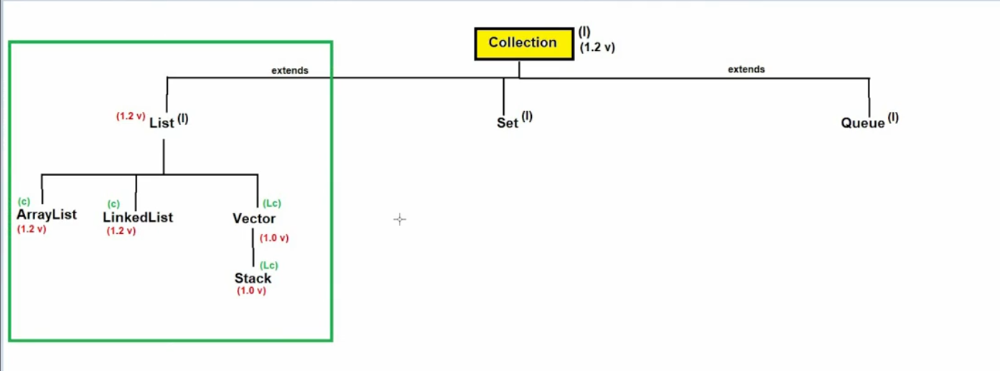
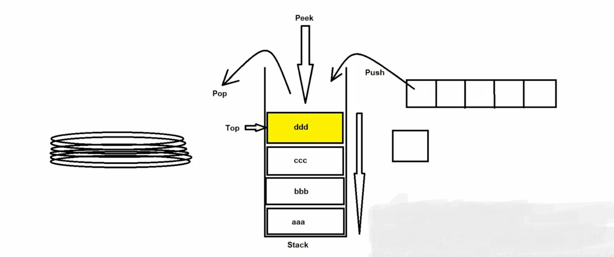
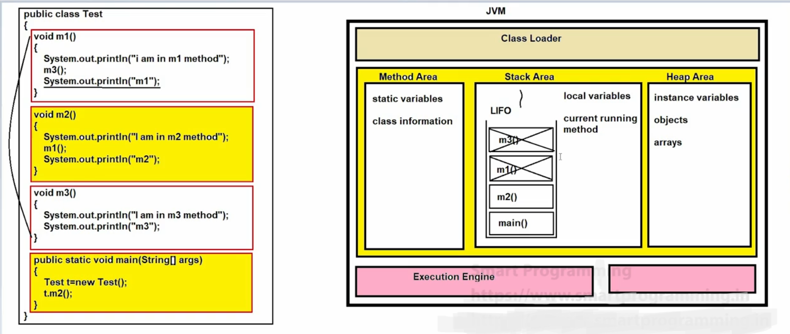
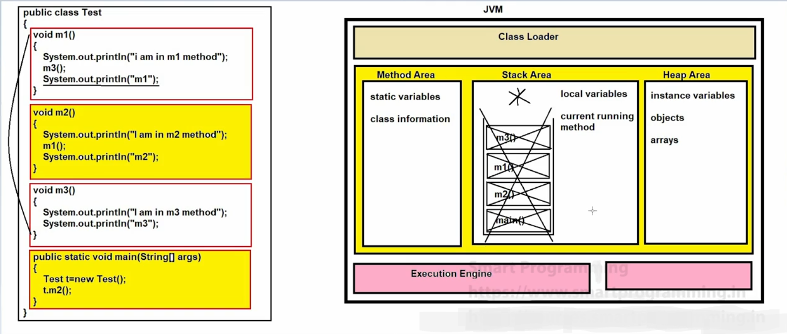

# 📦 Stack (Legacy Class) in Java

## 📌 Stack
- 🔹 **Stack** is the child class of **Vector** class present in `java.util` package.
- 🔹 **Syntax**:
  ```java
  public class Stack<E> extends Vector<E> { }
  ```
- 🔹 Stack was introduced in **JDK 1.0**.
- 🔹 Stack is also known as a **legacy class**.




> 🕰️ **Legacy Class**: A class that was designed in older versions of Java and later re-engineered or replaced with better alternatives.

---

## ✨ Properties of Stack
1. 📥 Stack class is specially designed for **LIFO (Last In First Out)**, but the algorithm can be customized as per requirement.
2. 🧱 Stack can be implemented using:
   - Array
   - ArrayList
   - LinkedList
   - Vector
3. 🔢 Stack is an **index-based data structure**.

---

## ⚙️ Working of Stack
- 🔄 Stack follows **LIFO (Last In First Out)** principle.
- 📌 The element inserted last will be removed first.



🧠 *Example:*
```
Push: 10 → 20 → 30
Pop : 30 → 20 → 10
```

---

## 🏗️ Constructors
- 🔹 `public Stack()`

---

## 🛠️ Methods of Stack

### 📚 Inherited Methods
- Methods of **Vector**, **List**, and **Collections**

### 📌 Stack-Specific Methods
1. ➕ `public Object push(Object obj)`

2. ➖ `public synchronized Object pop()`

3. 👀 `public synchronized Object peek()`

4. 🔍 `public synchronized int search(Object obj)`

5. 📭 `public boolean empty()`

---

## ⚠️ Note
👉 In modern Java, **Deque (ArrayDeque)** is preferred over Stack for better performance 🚀

---

## Implementation of StackMain.java Program :-





✨ *Happy Learning Java!* ☕🐍