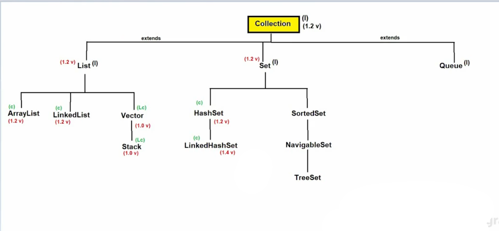
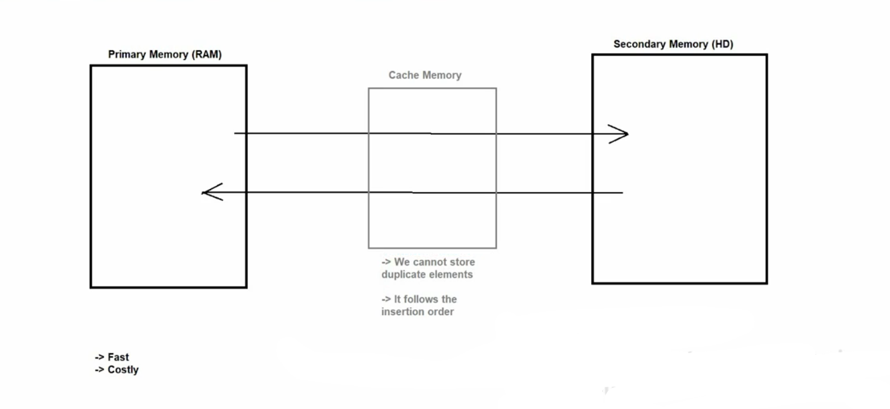
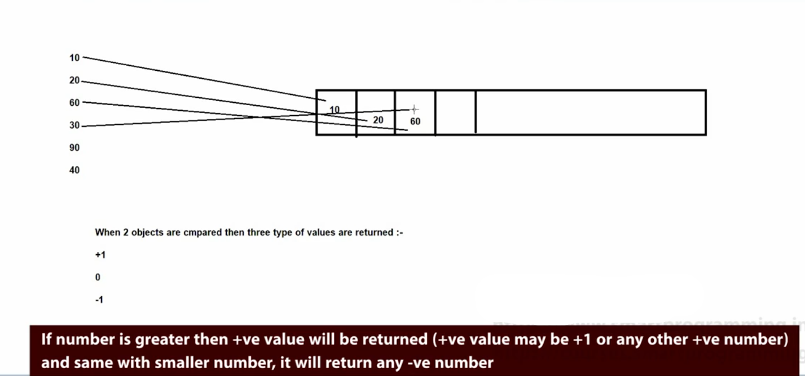
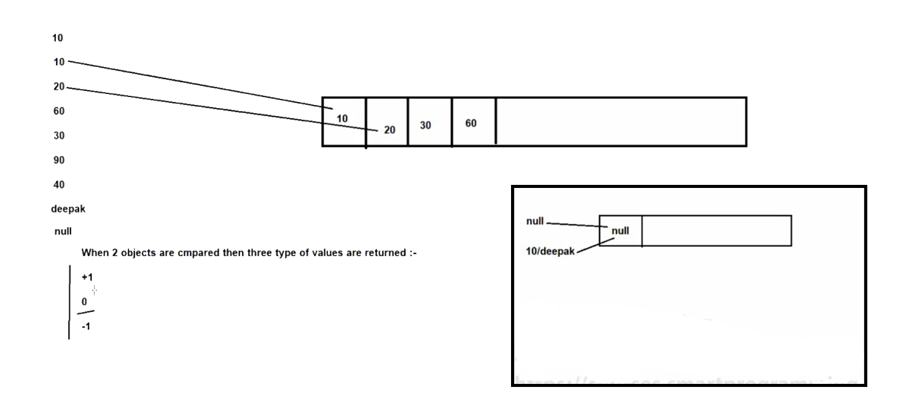

# 📘 Java Collections – Set Variants (Notes)

---

## 🔗 LinkedHashSet

### 📌 Definition
- **LinkedHashSet** is a child class of **HashSet** present in the `java.util` package.
- It maintains **insertion order** while storing elements.

### 🧩 Syntax
```java
public class LinkedHashSet extends HashSet implements Set, Cloneable, Serializable { }
```

### ⚙️ Underlying Data Structure
- **Hashtable + LinkedList**

### 🕰️ Introduced In
- **JDK 1.4**




### ✨ Properties
- All properties are the same as **HashSet**
- ✅ Maintains **insertion order**
- ❌ Does not allow duplicate elements
- ⚡ Faster than TreeSet
- 🚫 Allows only one `null` element

### 🏗️ Constructors
- Same constructors as **HashSet**

### 🛠️ Methods
- Same methods as **HashSet**

### 🎯 When to Use LinkedHashSet
- When **insertion order matters**
- Useful in **cache-based applications** 🗂️




### 🔄 Difference: HashSet vs LinkedHashSet

| Feature | HashSet | LinkedHashSet |
|------|-------|--------------|
| Introduced | JDK 1.2 | JDK 1.4 |
| Order | ❌ No order | ✅ Insertion order |
| Data Structure | Hashtable | Hashtable + LinkedList |

---

## 📊 SortedSet

### 📌 Definition
- **SortedSet** is a child interface of **Set** present in `java.util` package.

### 🧩 Syntax
```java
public interface SortedSet extends Set { }
```

### 🕰️ Introduced In
- **JDK 1.2**

### ✨ Properties
1. ❌ Not index-based
2. ❌ Does not follow insertion order
3. ✅ Follows **sorting order**
4. 🔁 Stores **homogeneous elements only**
5. 🚫 No duplicate elements
6. ❌ `null` values are not allowed
7. ✅ Allows **Comparable** objects by default
8. ❌ Non-synchronized collection

⚠️ Exceptions:
- `ClassCastException` → Different or non-comparable objects
- `NullPointerException` → When `null` is inserted

### 🛠️ Methods
```java
Object first();
Object last();
SortedSet headSet(Object toElement);
SortedSet tailSet(Object fromElement);
SortedSet subSet(Object fromElement, Object toElement);
```






---

## 🧭 NavigableSet

### 📌 Definition
- **NavigableSet** is a child interface of **SortedSet**.
- It provides **navigation methods** for searching elements.

### 🧩 Syntax
```java
public interface NavigableSet extends SortedSet { }
```

### 🕰️ Introduced In
- **Java SE 6**


### ✨ Properties
- All properties of **SortedSet**
- ➕ Provides extra **navigation methods**

### 🛠️ Methods
```java
NavigableSet descendingSet();
Object ceiling(Object obj);
Object higher(Object obj);
Object floor(Object obj);
Object lower(Object obj);
Object pollFirst();
Object pollLast();
```

📌 **Quick Tip:**
- `ceiling()` → ≥ element
- `higher()` → > element
- `floor()` → ≤ element
- `lower()` → < element

---

✨ **End of Notes** ✨

